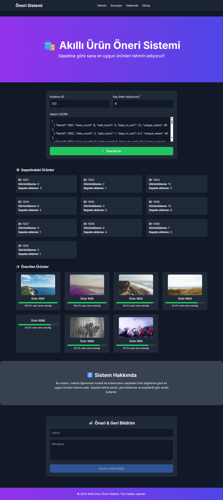

# 🛍️ Retail Recommendation App (Ürün Öneri Uygulaması)

This project is an AI-powered recommendation system that predicts the purchase likelihood of products based on users' shopping cart behavior. It helps e-commerce platforms suggest the most relevant products in real-time.  
(Bu proje, kullanıcıların alışveriş davranışlarına göre ürün satın alma olasılıklarını tahmin eden bir öneri sistemidir.)

Dataset: [RetailRocket E-Commerce Dataset](https://www.kaggle.com/datasets/retailrocket/ecommerce-dataset)

---

## 📁 Project Structure (Proje Klasör Yapısı)

```
retail_recommendation_app/
├── data/
│   ├── raw/                  # Raw input files (Ham veri dosyaları)
│   └── processed/            # Processed features (İşlenmiş öznitelikler)
├── models/                   # Trained model (Eğitilmiş model)
├── app/
│   └── api_server.py         # Optional FastAPI app (İkincil API)
├── static/
│   └── index.html            # Optional frontend (İsteğe bağlı arayüz)
├── train_pipeline.py         # Training pipeline (Veri hazırlık + eğitim)
├── server_api.py             # Main FastAPI server (Ana API)
├── requirements.txt          # Dependencies (Gereksinimler)
└── README.md
```


---

## 🚀 Getting Started (Başlarken)

### 🔧 Requirements (Gereksinimler)

- Python 3.9+
- `virtualenv` (optional but recommended)

Install dependencies (Gerekli paketleri yükleyin):
```bash
pip install -r requirements.txt
```

Required libraries (Kullanılan kütüphaneler):
- FastAPI
- Uvicorn
- Pandas
- Scikit-learn
- Joblib

---

## 📦 Dataset (Veri Seti)

⚠️ **Note:** Some files are excluded from the repository due to GitHub's size limits.  
(⚠️ Not: Bazı dosyalar boyut nedeniyle GitHub’a eklenmemiştir.)

Please download and manually place the following files:  
(Lütfen aşağıdaki dosyaları indirip klasörlere yerleştirin.)

- `data/raw/item_properties_part1.csv` (⚠️ ~460MB)
- `data/raw/item_properties_part2.csv` (⚠️ ~390MB)
- `data/raw/events.csv` (⚠️ ~90MB)
- `models/model.pkl` (eğitilmiş model dosyası)

Source: [RetailRocket Dataset](https://www.kaggle.com/datasets/retailrocket/ecommerce-dataset)

---

## 🧠 ML Pipeline (Makine Öğrenmesi Süreci)

### 1. Data Preprocessing (Veri Ön İşleme)
- Cleans missing and noisy data  
  (Eksik ve gürültülü veriler temizlenir)
- Filters by event types: `view`, `addtocart`, `transaction`  
  (Sadece anlamlı etkileşim türleri alınır)

### 2. Feature Engineering (Öznitelik Oluşturma)
- View and add-to-cart counts (Görüntüleme ve sepete ekleme sayısı)
- Time in cart (Sepette geçen süre)
- Product popularity (Ürün popülaritesi)
- One-hot/categorical encodings

### 3. Model Training (Model Eğitimi)
- Trains multiple models:
  - ✅ Random Forest (final model)
  - Logistic Regression (tested)
- Evaluation metrics: Precision, Recall, F1 Score  
  (Değerlendirme: Kesinlik, Duyarlılık, F1)

### 4. Saving Outputs (Çıktıların Kaydedilmesi)
- Features: `data/processed/features.csv`
- Model: `models/model.pkl`

---

## 🧪 Running the Project (Projeyi Çalıştırma)

### 1. Train the Model (Modeli Eğit)

```bash
python train_pipeline.py
```

This will:
- Load and process raw data (Ham verileri işler)
- Extract features (Öznitelikleri çıkarır)
- Train and save model (Modeli eğitip kaydeder)

### 2. Start the API Server (API Servisini Başlat)

```bash
uvicorn server_api:app --reload
```

Then visit:  
[http://127.0.0.1:8000/docs](http://127.0.0.1:8000/docs) → (Swagger arayüzü)

---

## 📡 API Endpoints (API Uç Noktaları)

| Method | Endpoint     | Açıklama (Description)                    |
|--------|--------------|------------------------------------------|
| GET    | `/health`    | Health check (Servis ayakta mı?)         |
| POST   | `/recommend` | Get top-K product recommendations        |

### 🔁 Example Input (Örnek Girdi)

```json
[
  { "itemid": 1001, "view_count": 5, "add_count": 2, "days_in_cart": 1.2, "unique_views": 90 },
  { "itemid": 1002, "view_count": 3, "add_count": 1, "days_in_cart": 0.5, "unique_views": 120 },
  { "itemid": 1003, "view_count": 9, "add_count": 5, "days_in_cart": 3.1, "unique_views": 180 },
  { "itemid": 1004, "view_count": 2, "add_count": 0, "days_in_cart": 0.3, "unique_views": 60 },
  { "itemid": 1005, "view_count": 7, "add_count": 4, "days_in_cart": 1.0, "unique_views": 100 },
  { "itemid": 1006, "view_count": 12, "add_count": 6, "days_in_cart": 2.2, "unique_views": 200 },
  { "itemid": 1007, "view_count": 3, "add_count": 1, "days_in_cart": 0.8, "unique_views": 75 },
  { "itemid": 1008, "view_count": 10, "add_count": 3, "days_in_cart": 2.0, "unique_views": 130 },
  { "itemid": 1009, "view_count": 4, "add_count": 1, "days_in_cart": 0.6, "unique_views": 85 },
  { "itemid": 1010, "view_count": 6, "add_count": 2, "days_in_cart": 1.1, "unique_views": 95 }
]
```

---

## 🔍 Notes on Missing Files (Yüklenmeyen Dosyalar)

The following files were **excluded from GitHub** due to large size:

- `data/raw/item_properties_part1.csv`
- `data/raw/item_properties_part2.csv`
- `data/raw/events.csv`
- `models/model.pkl`

👉 Place them in the correct folders manually:
- Raw data → `data/raw/`
- Trained model → `models/`

Aksi takdirde kodlar hata verecektir.

---

## 📸 Example Screenshot (Web Arayüzü Örneği)




---

## 📮 Contact (İletişim)

You can report issues or give feedback through:
- GitHub Issues tab
- (Or any in-app feedback section you create)

---

## 📄 License (Lisans)

MIT License © 2025 — Built with ❤️ by Yaren Suludağ
